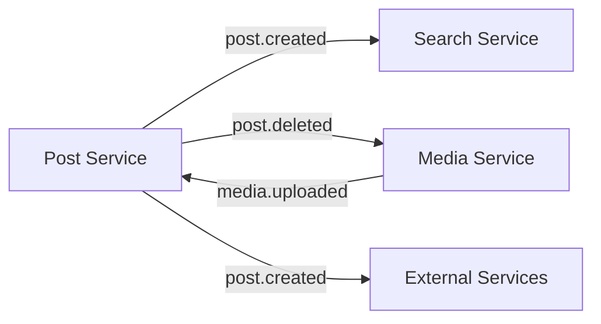
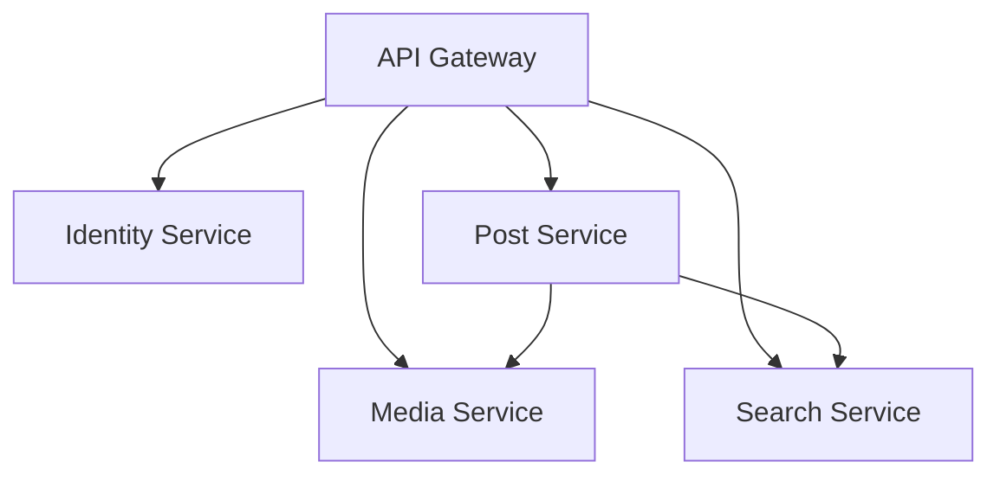

# 🚀 Microservices Architecture

> A modern, scalable microservices implementation built with Node.js, featuring authentication, post management, media handling, and search capabilities.

## 🎯 System Overview


This project implements a complete microservices architecture with the following services:

- **🔐 Identity Service** (Port 3001): Authentication and user management
- **📝 Post Service** (Port 3002): Content creation and management
- **🖼️ Media Service** (Port 3003): File upload and storage
- **🔍 Search Service** (Port 3004): Content search functionality
- **🌐 API Gateway** (Port 3000): Central entry point and request routing

## 🛠️ Shared Tech Stack

- **Runtime**: Node.js
- **Framework**: Express.js
- **Database**: MongoDB
- **Caching**: Redis
- **Message Broker**: RabbitMQ
- **Container**: Docker
- **Logging**: Winston

## 🔌 Service Communication

### Event-Driven Architecture



### Service Interactions

1. **Post Creation Flow**:
   - User authenticates via Identity Service
   - Creates post through Post Service
   - Uploads media via Media Service
   - Search Service indexes new content

2. **Post Deletion Flow**:
   - Post Service triggers deletion
   - Media Service cleans up associated files
   - Search Service removes from index

## 🔑 Key Features

### Identity Service
- JWT-based authentication
- Refresh token rotation
- Secure password hashing (Argon2)

### Post Service
- Content CRUD operations
- Redis caching
- Event publishing

### Media Service
- Cloudinary integration
- Multi-file upload
- Automatic cleanup

### Search Service
- Full-text search
- Real-time indexing
- Relevance scoring

## 🚀 Quick Start

1. **Clone Repository**
```bash
git clone <repository-url>
```

2. **Configure Environment**
```bash
# Copy .env files for each service
cp .env.example .env
```

3. **Start Services**
```bash
docker-compose up
```

## 🌐 Environment Setup

```env
# Core Services
MONGODB_URI="your-mongodb-connection-string"
REDIS_URL=redis://localhost:6379
RABBITMQ_URL=amqp://localhost:5672

# Service URLs
API_GATEWAY_URL=http://localhost:3000
IDENTITY_SERVICE_URL=http://localhost:3001
POST_SERVICE_URL=http://localhost:3002
MEDIA_SERVICE_URL=http://localhost:3003
SEARCH_SERVICE_URL=http://localhost:3004
```

## 📊 Monitoring & Scaling

- **Rate Limiting**: Per-service configurable limits
- **Caching**: Strategic Redis caching
- **Logging**: Centralized Winston logging

## 🔐 Security Features

- **Authentication**: JWT with refresh tokens
- **Rate Limiting**: Redis-based request throttling
- **Input Validation**: Joi schema validation
- **Secure Headers**: Helmet implementation

## 🔄 Service Dependencies



## 📚 API Documentation (Upcoming)

Detailed API documentation for each service is available at:
- API Gateway: `/api-docs`
- Identity Service: `/auth/docs`
- Post Service: `/posts/docs`
- Media Service: `/media/docs`
- Search Service: `/search/docs`

---

Made with ❤️ 
